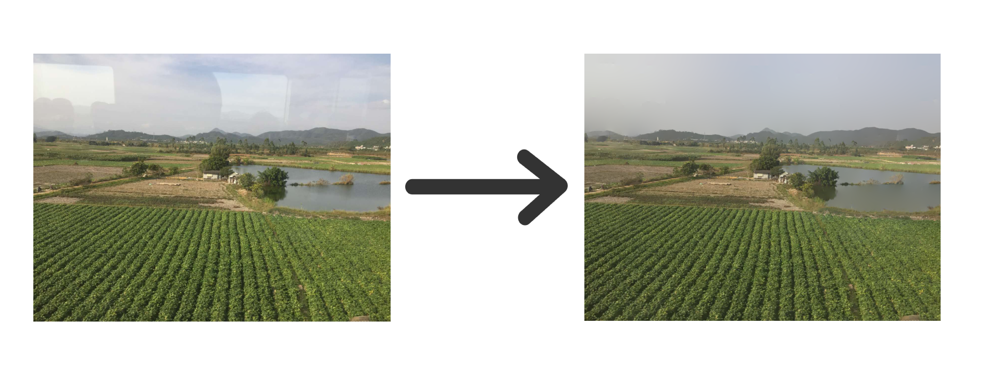

# Fast Reflection Removal
Removes reflections quickly and easily.



## How to install
**Prerequisities**
- Python: 3.8

### As a package
In your own project, just perform the following command:
```bash
# python refers to the virtual environment to install package to
python -m pip install git+https://github.com/JanPalasek/fast-reflection-removal
```

Now, you can use the reflection removal in your project in the following manner:
```python
from frr.core import FastReflectionRemoval

...
# numpy array with values between 0 and 1 of shape (H, W, C)
img = ...
# instantiate the algoroithm class
alg = FastReflectionRemoval(h = 0.11)
# run the algorithm and get result of shape (H, W, C)
dereflected_img = alg.remove_reflection(img)


...
```

### As a repository
1. Clone the project and go to its root directory.
2. Create and activate the virtual environment:
    ```bash
    # create the environment
    python3 -m venv "venv"
    # activate the environment
    source venv/bin/activate # on Windows ./venv/Scripts/activate.ps1 in Powershell
    ```
3. Install the necessary packages:
    ```bash
    python -m pip install --upgrade pip
    python -m pip install --upgrade wheel setuptools pip-tools
    ```
4. Install the packages from requirements and the project:
    ```bash
    make sync # on windows just perform the following commands: python -m piptools sync requirements.txt; python -m pip install -e .
    ```

## How to run the project
To run the project, we need to run script bin/run.py. The important parameters of this script are:
- ***h***: larger h leads to more reflections removed, but the result image will be blurrier,
- ***input_path***: path to the input image,
- ***output_path***: path to the output image.

Example:
```bash
# activate the environment
source venv/bin/activate # on Windows ./venv/Scripts/activate.ps1 in Powershell
python bin/run.py --h=0.11 --input_path="docs/toy_example.jpg" --output_path="docs/toy_example_out.jpg"
```

The program, in this example, loads input image from the path docs/toy_example.jpg, processes it with parameter h=0.11 and outputs it into docs/toy_example_out.jpg.


## Project structure
Folders:
- *bin*: executable python files.
- *docs*: documentation.
- *src*: contains list of folders for sources, e.g. python.
- *tests*: follows the structure of src/python.

## Credits
This repository implements paper [Fast Single Image Reflection Suppression via Convex Optimization](https://arxiv.org/pdf/1903.03889.pdf) authored by Yang Yang, Wenye Ma, Yin Zheng, Jian-Feng Cai and Weiyu Xu.
